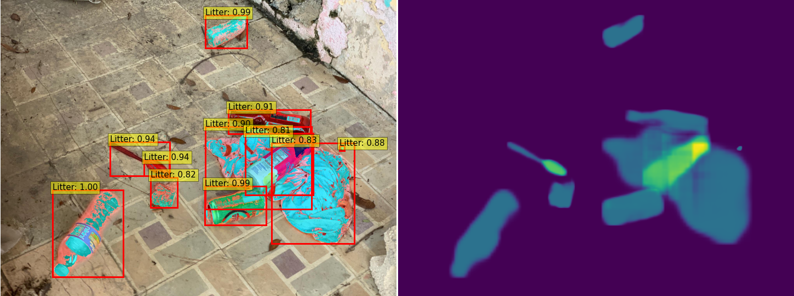

# PyTorch-MaskRCNN


A PyTorch implementation of simple Mask R-CNN.

This repository is a toy example of Mask R-CNN with two features:
- It is pure python code and can be run immediately using PyTorch 1.5.1 and trochvision 0.8.2,
- Simplified construction and easy to understand how the model works based on [tutorial](https://pytorch.org/tutorials/intermediate/torchvision_tutorial.html).

The code is based largely on [TorchVision](https://github.com/pytorch/vision).

## Requirements

- **Windows** or **Linux**, with **Python ≥ 3.7**
- **[PyTorch](https://pytorch.org/) ≥ 1.5.0**
- **matplotlib** - visualizing images and results
- **[pycocotools](https://github.com/cocodataset/cocoapi)** - for COCO dataset and evaluation; Windows version is [here](https://github.com/philferriere/cocoapi)

### Neptune
To track logs (for example training loss) we used [neptune.ai](https://neptune.ai/). If you are interested in logging your experiments there, you should create account on the platform and create new project. Then:
* Find and set Neptune API token on your system as environment variable (your NEPTUNE_API_TOKEN should be added to ~./bashrc)
* Add your project_qualified_name name in the `train.py`
    ```python
      neptune.init(project_qualified_name = 'YOUR_PROJECT_NAME/detect-waste')
    ```
    Currently it is set to private detect-waste neptune space.
* install neptun-client library
    ```bash
      pip install neptune-client
    ```
To run experiments with neptune simply add `--neptune` flag during launch `train.py`.

For more check [LINK](https://neptune.ai/how-it-works).

## Datasets

This repository supports detect-waste datasets (usualy COCO based annotations) with one class - waste.

We expect the directory structure to be the following:
```
path/to/repository/
  annotations/         # annotation json files
path/to/images/        # all images
```
You can modify `datasets/data.py` script to add new dataset and another format of paths for coco annotations type.

Check `detect-waste/annotations/README.md` to verify provided annotations by [Detect Waste in Pomerania team](https://detectwaste.ml/).

## Training

Simply run:

```
python3 train.py --num_epochs 26 --gpu_id 2 --output_dir /path/to/save/checkpoints --images_dir /path/to/images
```
or modify the parameters in ```run.sh```, and run:

```
bash ./run.sh
```

Note: This is a simple model and only supports one gpu (not distribiuted training).

## Evaluation

Simply run on cuda:2:

```python
python train.py --gpu_id 2 --images_dir /path/to/images --resume /path/to/checkpoint.pth --test-only
```

or modify the parameters in ```notebooks/eval.ipynb``` to visualize predictions of the model.

## Performance

The model utilizes part of TorchVision's weights, which is pretrained on COCO dataset.
Test on Multi detect-waste Segmentation val, on 1 RTX 2080Ti GPU:

|     model   | backbone     |  dataset | bbox AP@0.5 | bbox AP@0.5:0.95 | mask AP@0.5 | mask AP@0.5:0.95 |
| :---------: | :---------:  | :------: | :---------: |  :-------------: | :---------: | :--------------: |
| Mask R-CNN  | ResNet 50    |  Multi   |    27.95    |       16.49      |   23.05     |    12.94         |
| Mask R-CNN  | ResNetXt 101`*` |  Multi   |    19.70    |       6.20       |   24.70     |    13.20         |

* `*` results achived using [mmdetection framework](https://github.com/open-mmlab/mmdetection).
