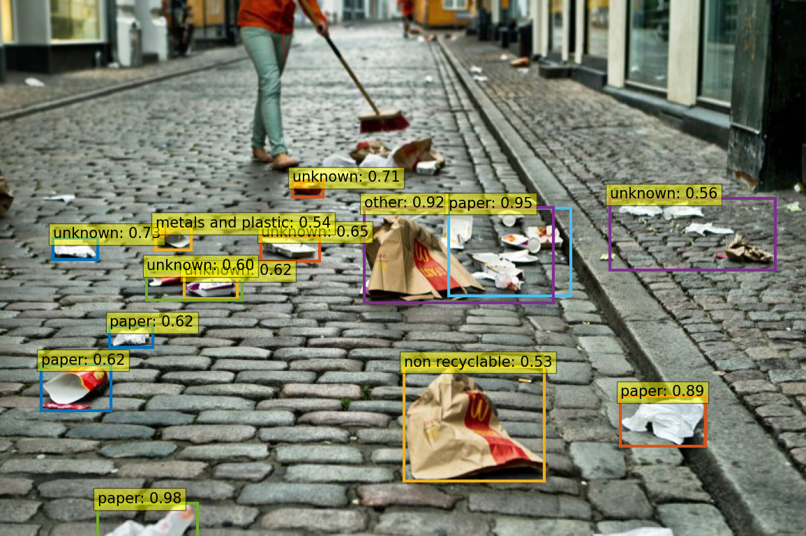

[](https://zenodo.org/badge/latestdoi/314221459)


# Detect waste
AI4Good project for detecting waste in environment.
[www.detectwaste.ml](www.detectwaste.ml).

Our latest results were published in Waste Management journal in article titled [Deep learning-based waste detection in natural and urban environments](https://www.sciencedirect.com/science/article/pii/S0956053X21006474?dgcid=coauthor#fn1).

You can find more technical details in our technical report [Waste detection in Pomerania: non-profit project for detecting waste in environment](https://arxiv.org/abs/2105.06808).

Did you know that we produce 300 million tons of plastic every year? And only the part of it is properly recycled.

The idea of detect waste project is to use Artificial Intelligence to detect plastic waste in the environment. Our solution is applicable for video and photography. Our goal is to use AI for Good.



# Datasets

In Detect Waste in Pomerania project we used 9 publicity available datasets, and additional data collected using [Google Images Download](https://github.com/hardikvasa/google-images-download).

For more details, about the data we used, check our [jupyter notebooks](https://github.com/wimlds-trojmiasto/detect-waste/tree/main/notebooks) with data exploratory analysis.

## Data download (WIP)
Data annotations: https://github.com/wimlds-trojmiasto/detect-waste/tree/main/annotations

* TACO bboxes - in progress. TACO dataset can be downloaded [here](http://tacodataset.org/). TACO bboxes will be avaiable for download soon.

    Clone Taco repository
        `git clone https://github.com/pedropro/TACO.git`

    Install requirements
        `pip3 install -r requirements.txt`

    Download annotated data
        `python3 download.py`

* [UAVVaste](https://github.com/UAVVaste/UAVVaste)

    Clone UAVVaste repository
        `git clone https://github.com/UAVVaste/UAVVaste.git`

    Install requirements
        `pip3 install -r requirements.txt`

    Download annotated data
        `python3 main.py`

* [TrashCan 1.0](https://conservancy.umn.edu/handle/11299/214865)

    Download directly from web
    `wget https://conservancy.umn.edu/bitstream/handle/11299/214865/dataset.zip?sequence=12&isAllowed=y`

* [TrashICRA](https://conservancy.umn.edu/handle/11299/214366)

    Download directly from web
    `wget https://conservancy.umn.edu/bitstream/handle/11299/214366/trash_ICRA19.zip?sequence=12&isAllowed=y`

* [MJU-Waste](https://github.com/realwecan/mju-waste/)

    Download directly from [google drive](https://drive.google.com/file/d/1o101UBJGeeMPpI-DSY6oh-tLk9AHXMny/view)

* [Drinking Waste Classification](https://www.kaggle.com/arkadiyhacks/drinking-waste-classification)

    In order to download you must first authenticate using a kaggle API token. Read about it [here](https://www.kaggle.com/docs/api#getting-started-installation-&-authentication)

    `kaggle datasets download -d arkadiyhacks/drinking-waste-classification`

* [Wade-ai](https://github.com/letsdoitworld/wade-ai/tree/master/Trash_Detection)

    Clone wade-ai repository
        `git clone https://github.com/letsdoitworld/wade-ai.git`

    For coco annotation check: [majsylw/wade-ai/tree/coco-annotation](https://github.com/majsylw/wade-ai/tree/coco-annotation/Trash_Detection/trash/dataset)

* [TrashNet](https://github.com/garythung/trashnet) - The dataset spans six classes: glass, paper, cardboard, plastic, metal, and trash.

    Clone trashnet repository
        `git clone https://github.com/garythung/trashnet`

* [waste_pictures](https://www.kaggle.com/wangziang/waste-pictures) - The dataset contains ~24k images grupped by 34 classes of waste for classification purposes.

    In order to download you must first authenticate using a kaggle API token. Read about it [here](https://www.kaggle.com/docs/api#getting-started-installation-&-authentication)

    `kaggle datasets download -d wangziang/waste-pictures`

For more datasets check: [waste-datasets-review](https://github.com/AgaMiko/waste-datasets-review)

## Data preprocessing

### Multiclass training
To train only on TACO dataset with detect-waste classes:
* run *annotations_preprocessing.py*

    `python3 annotations_preprocessing.py`

    new annotations will be saved in *annotations/annotations_train.json* and *annotations/annotations_test.json*

    For binary detection (<i>litter</i> and <i>background</i>) check also generated new annotations saved in *annotations/annotations_binary_train.json* and *annotations/annotations_binary_test.json*.

### Single class training

To train on one or multiple datasets on a single class:

* run *annotations_preprocessing_multi.py*

    `python3 annotations_preprocessing_multi.py`

    new annotations will be split and saved in *annotations/binary_mixed_train.json* and *annotations/binary_mixed_test.json*

    Example bash file is in **annotations_preprocessing_multi.sh** and can be run by

    `bash annotations_preprocessing_multi.sh`

Script will automatically split all datasets to train and test set with `MultilabelStratifiedShuffleSplit`. Then it will convert datasets to one class - litter. Finally all datasets will be concatenated to form single train and test files `annotations/binary_mixed_train.json` and `annotations/binary_mixed_test`.

For more details check [annotations directory](https://github.com/wimlds-trojmiasto/detect-waste/tree/main/annotations).

# Models

To read more about past waste detection works check [litter-detection-review](https://github.com/majsylw/litter-detection-review).

* ### EfficientDet

    To train EfficientDet check `efficientdet/README.md`

    To train EfficientDet implemented in Pytorch Lightning check branch `effdet_lightning`

    We based our implementation on [efficientdet-pytorch](https://github.com/rwightman/efficientdet-pytorch) by Ross Wightman.

* ### DETR

    To train detr check `detr/README.md` (WIP)

    PyTorch training code and pretrained models for **DETR** (**DE**tection **TR**ansformer).
    Authors replaced the full complex hand-crafted object detection pipeline with a Transformer, and matched Faster R-CNN with a ResNet-50, obtaining **42 AP** on COCO using half the computation power (FLOPs) and the same number of parameters. Inference in 50 lines of PyTorch.

    For implementation details see [End-to-End Object Detection with Transformers](https://github.com/facebookresearch/detr) by Facebook.

* ### Mask R-CNN
    To train Mask R-CNN check `MaskRCNN/README.md`

    Our implementation based on [tutorial](https://pytorch.org/tutorials/intermediate/torchvision_tutorial.html).

* ### Faster R-CNN
    To train Faster R-CNN on TACO dataset check `FastRCNN/README.md`

* ### Classification with ResNet50 and EfficientNet
    To train choosen model check `classifier/README.md`


## Example usage - models training

1. Waste detection using EfficientDet

In our github repository you will find [EfficientDet code](https://github.com/wimlds-trojmiasto/detect-waste/tree/main/efficientdet) already adjusted for our mixed dataset. To run training for single class just clone repository, move to efficientdet directory, install necessary dependencies, and launch ```train.py``` script with adjusted parameters, like: path to images, path to directory with annotations (you can use ours provided in [annotations directory](https://github.com/wimlds-trojmiasto/detect-waste/tree/main/annotations)), model parameters and its specific name. It can be done as in the example below.

```bash
python3 train.py path_to_all_images \
--ann_name ../annotations/binary_mixed --model tf_efficientdet_d2 \
--batch-size 4 --decay-rate 0.95 --lr .001 --workers 4 --warmup-epochs 5 \
--model-ema --dataset multi --pretrained --num-classes 1 --color-jitter 0.1 \
--reprob 0.2 --epochs 20 --device cuda:0
```

2. Waste classification using EfficientNet

In this step switch to [classifier directory](https://github.com/wimlds-trojmiasto/detect-waste/tree/main/classifier). At first just crop waste objects from images of waste (the same as in previous step).

```bash
python3 cut_bbox_litter.py --src_img path_to_whole_images \
                           --dst_img path_to_destination_directory_for_images \
                           --square --zoom 1
```

In case of using unlabelled [OpenLitterMap dataset](https://openlittermap.com/), make pseudo-predictions using previously trained EfficientDet and map them with orginal openlittermap annotations.

```bash
python3 sort_openlittermap.py \
                        --src_ann path_to_original_openlittermap_annotations \
                        --coco path_to_our_openlittermap_annotations \
                        --src_img path_to_whole_images \
                        --dst_img path_to_destination_directory_for_images
```

To run classifier training in command line just type:

```bash
python train_effnet.py --data_img path/to/images/train/ \
                       --save path/to/checkpoint.ckpt \
                       --model efficientnet-b2 \
                       --gpu 0 \
                       --pseudolabel_mode per-batch
```

## Evaluation

We provided `make_predictions.py` script to draw bounding boxes on choosen image. For example script can be run on GPU (id=0) with arguments:

```bash
    python make_predictions.py --save directory/to/save/image.png \
                               --detector path/to/detector/checkpoint.pth \
                               --classifier path/to/clasifier/checkpoint.pth \
                               --img path/or/url/to/image --device cuda:0
```
or on video with `--video` argument:

```bash
    python make_predictions.py --save directory/to/save/frames \
                               --detector path/to/detector/checkpoint.pth \
                               --classifier path/to/clasifier/checkpoint.pth \
                               --img path/to/video.mp4 --device cuda:0 --video \
                               --classes label0 label1 label2
```

If you managed to process all the frames, just run the following command from the directory where you saved the results:

```bash
    ffmpeg -i img%08d.jpg movie.mp4
```

## Tracking experiments
For experiment tracking we mostly used [neptune.ai](https://neptune.ai/). To use `Neptune` follow the official Neptune tutorial on their website:
* Log in to your account
* Find and set Neptune API token on your system as environment variable (your NEPTUNE_API_TOKEN should be added to ~./bashrc)
* Add your project_qualified_name name in the `train_<net_name>.py`
    ```python
      neptune.init(project_qualified_name = 'YOUR_PROJECT_NAME/detect-waste')
    ```
  Currently it is set to a private detect-waste neptune space.

* install neptune-client library

    ```bash
      pip install neptune-client
    ```

For more check [LINK](https://neptune.ai/how-it-works).

## Our results

### Detection/Segmentation task
| model  | backbone  | Dataset       | # classes | bbox AP@0.5 | bbox AP@0.5:0.95 | mask AP@0.5 | mask AP@0.5:0.95 |
| :-----:| :-------: | :-----------: | :-------: | :---------: | :--------------: | :---------: | :--------------: |
| DETR  | ResNet 50 |TACO bboxes| 1      |    46.50    |       24.35      |      x      |  x              |
| DETR  | ResNet 50 |TACO bboxes| 7      |    12.03    |       6.69       |      x      |  x              |
| DETR  | ResNet 50 |`*`Multi   | 1      |    50.68    |       27.69      | `**`54.80   |  `**`32.17      |
| DETR  |ResNet 101 |`*`Multi   | 1      |    51.63    |       29.65      |      37.02  |      19.33      |
| Mask R-CNN  | ResNet 50    |  `*`Multi   |  1    |    27.95 |       16.49   |    23.05     |    12.94       |
| Mask R-CNN  | ResNetXt 101 |  `*`Multi   |  1    |    19.70 |       6.20    |    24.70     |    13.20       |
| EfficientDet-D2 | EfficientNet-B2 |    Taco bboxes  |  1    |    61.05  |   x     |    x     |      x  |
| EfficientDet-D2 | EfficientNet-B2 |    Taco bboxes  |  7    |    18.78  |   x     |    x     |      x  |
| EfficientDet-D2 | EfficientNet-B2 |    Drink-waste  |  4    |    99.60  |   x     |    x     |      x  |
| EfficientDet-D2 | EfficientNet-B2 |    MJU-Waste    |  1    |    97.74  |   x     |    x     |      x  |
| EfficientDet-D2 | EfficientNet-B2 |    TrashCan v1  |  8    |    91.28  |   x     |    x     |      x  |
| EfficientDet-D2 | EfficientNet-B2 |    Wade-AI      |  1    |    33.03  |   x     |    x     |      x  |
| EfficientDet-D2 | EfficientNet-B2 |    UAVVaste     |  1    |    79.90  |   x     |    x     |      x  |
| EfficientDet-D2 | EfficientNet-B2 |    Trash ICRA19 |  7    |    9.47   |   x     |    x     |      x  |
| EfficientDet-D2 | EfficientNet-B2 |    `*`Multi        |  1    |    74.81  |   x     |    x     |      x  |
| EfficientDet-D3 | EfficientNet-B3 |    `*`Multi        |  1    |    74.53  |   x     |    x     |      x  |

* `*` Multi - name for mixed open dataset (with listed below datasets) for detection/segmentation task
* `**` results achived with frozeen weights from detection task (after addition of mask head)

**Pretrained weights of the best efficientdet model are available to download here: https://drive.google.com/drive/u/0/folders/1wNWoH8rdkG05sBw-OCXp3J73uJPxhcxH**

### Classification task

|      model      | # classes | ACC | sampler | pseudolabeling |
| :--------------:| :-------: | :--:| :-----: | :------------: |
| EfficientNet-B2 | 8         |73.02| Weighted| per batch      |
| EfficientNet-B2 | 8         |74.61| Random  | per epoch      |
| EfficientNet-B2 | 8         |72.84| Weighted| per epoch      |
| EfficientNet-B4 | 7         |71.02| Random  | per epoch      |
| EfficientNet-B4 | 7         |67.62| Weighted| per epoch      |
| EfficientNet-B2 | 7         |72.66| Random  | per epoch      |
| EfficientNet-B2 | 7         |68.31| Weighted| per epoch      |
| EfficientNet-B2 | 7         |74.43| Random  | None           |
| ResNet-50       | 8         |60.60| Weighted| None           |

* 8 classes - 8th class for additional background category
* we provided 2 methods to update pseudo-labels: per batch and per epoch

## Citation

```
@article{MAJCHROWSKA2022274,
      title = {Deep learning-based waste detection in natural and urban environments},
      journal = {Waste Management},
      volume = {138},
      pages = {274-284},
      year = {2022},
      issn = {0956-053X},
      doi = {https://doi.org/10.1016/j.wasman.2021.12.001},
      url = {https://www.sciencedirect.com/science/article/pii/S0956053X21006474},
      author = {Sylwia Majchrowska and Agnieszka Mikołajczyk and Maria Ferlin and Zuzanna Klawikowska
                and Marta A. Plantykow and Arkadiusz Kwasigroch and Karol Majek},
      keywords = {Object detection, Semi-supervised learning, Waste classification benchmarks,
                  Waste detection benchmarks, Waste localization, Waste recognition},
}

@misc{majchrowska2021waste,
      title={Waste detection in Pomerania: non-profit project for detecting waste in environment}, 
      author={Sylwia Majchrowska and Agnieszka Mikołajczyk and Maria Ferlin and Zuzanna Klawikowska
              and Marta A. Plantykow and Arkadiusz Kwasigroch and Karol Majek},
      year={2021},
      eprint={2105.06808},
      archivePrefix={arXiv},
      primaryClass={cs.CV}
}
```

## Project Organization (WIP)
------------

    ├── LICENSE
    ├── README.md
    |         <- The top-level README for developers using this project.
    ├── annotations        <- annotations in json
    │   
    ├── classifier        <- implementation of CNN for litter classification
    │
    ├── detr              <- implementation of DETR for litter detection
    │
    ├── efficientdet      <- implementation of EfficientDet for litter detection
    │
    ├── fastrcnn          <- implementation of FastRCNN for litter segmentation
    │
    ├── maskrcnn          <- implementation of MaskRCNN for litter segmentation
    │
    ├── notebooks          <- jupyter notebooks.
    │   
    ├── utils              <- source code with useful functions
    │
    ├── requirements.txt   <- The requirements file for reproducing the analysis environment, e.g.
    │                         generated with `pip freeze > requirements.txt`
    ├── setup.py           <- makes project pip installable (pip install -e .) so src can be imported
    ├── src                <- Source code for use in this project.


--------
