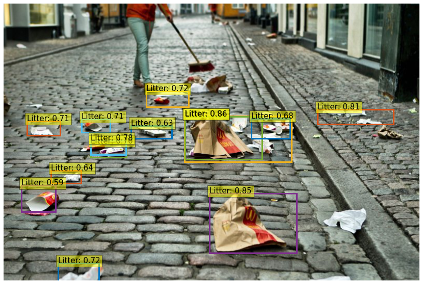

# **DE⫶TR** (PyTorch) for waste detection



PyTorch training code and pretrained models for **DETR** (**DE**tection **TR**ansformer).
Authors replace the full complex hand-crafted object detection pipeline with a Transformer, and match Faster R-CNN with a ResNet-50, obtaining **42 AP** on COCO using half the computation power (FLOPs) and the same number of parameters. Inference in 50 lines of PyTorch.

For details see [End-to-End Object Detection with Transformers](https://ai.facebook.com/research/publications/end-to-end-object-detection-with-transformers) by Nicolas Carion, Francisco Massa, Gabriel Synnaeve, Nicolas Usunier, Alexander Kirillov, and Sergey Zagoruyko.

# Implementation
A PyTorch **DE⫶TR** for detecting waste using implementation from  [Official facebookresearch implementation](https://github.com/facebookresearch/detr).

Authors provided baseline DETR and DETR-DC5 models, and plan to include more in future.
AP is computed on COCO 2017 val5k, and inference time is over the first 100 val5k COCO images,
with torchscript transformer.

<table>
  <thead>
    <tr style="text-align: right;">
      <th></th>
      <th>name</th>
      <th>backbone</th>
      <th>schedule</th>
      <th>inf_time</th>
      <th>box AP</th>
      <th>url</th>
      <th>size</th>
    </tr>
  </thead>
  <tbody>
    <tr>
      <th>0</th>
      <td>DETR</td>
      <td>R50</td>
      <td>500</td>
      <td>0.036</td>
      <td>42.0</td>
      <td><a href="https://dl.fbaipublicfiles.com/detr/detr-r50-e632da11.pth">model</a>&nbsp;|&nbsp;<a href="https://dl.fbaipublicfiles.com/detr/logs/detr-r50_log.txt">logs</a></td>
      <td>159Mb</td>
    </tr>
    <tr>
      <th>1</th>
      <td>DETR-DC5</td>
      <td>R50</td>
      <td>500</td>
      <td>0.083</td>
      <td>43.3</td>
      <td><a href="https://dl.fbaipublicfiles.com/detr/detr-r50-dc5-f0fb7ef5.pth">model</a>&nbsp;|&nbsp;<a href="https://dl.fbaipublicfiles.com/detr/logs/detr-r50-dc5_log.txt">logs</a></td>
      <td>159Mb</td>
    </tr>
    <tr>
      <th>2</th>
      <td>DETR</td>
      <td>R101</td>
      <td>500</td>
      <td>0.050</td>
      <td>43.5</td>
      <td><a href="https://dl.fbaipublicfiles.com/detr/detr-r101-2c7b67e5.pth">model</a>&nbsp;|&nbsp;<a href="https://dl.fbaipublicfiles.com/detr/logs/detr-r101_log.txt">logs</a></td>
      <td>232Mb</td>
    </tr>
    <tr>
      <th>3</th>
      <td>DETR-DC5</td>
      <td>R101</td>
      <td>500</td>
      <td>0.097</td>
      <td>44.9</td>
      <td><a href="https://dl.fbaipublicfiles.com/detr/detr-r101-dc5-a2e86def.pth">model</a>&nbsp;|&nbsp;<a href="https://dl.fbaipublicfiles.com/detr/logs/detr-r101-dc5_log.txt">logs</a></td>
      <td>232Mb</td>
    </tr>
  </tbody>
</table>

COCO val5k evaluation results can be found in this [gist](https://gist.github.com/szagoruyko/9c9ebb8455610958f7deaa27845d7918).

The models are also available via torch hub,
to load DETR R50 with pretrained weights simply do:
```python
model = torch.hub.load('facebookresearch/detr', 'detr_resnet50', pretrained=True)
```

# Detect-waste dataset & model modifications
* we use TACO dataset with additional annotated data from detect-waste,
* we use few waste dataset mentioned in main `README.md` with annotated data by bbox (and sometimes also with mask).

We expect the directory structure to be the following:
```
path/to/repository/
  annotations/         # annotation json files
path/to/images/        # all images
```
You can modify `datasets/coco.py` and `datasets/__init__.py` build functions to add new dataset and another format of paths for coco annotations type.

Check `detect-waste/annotations/README.md` to verify provided annotations by [Detect Waste in Pomerania team](https://detectwaste.ml/).

## Model details
* Optimizer: AdamW or LaProp
* Number of class: 7 (paper, metals and plastics, bio, other, non-recycle, glass, unknown) or 1 (litter)
* Backbone: ResNet50
* Num queries: 100 (like in official Detr it coressponds to max number of instances per images - this should not be changed if we finetuned)
* Eos coef: 0.1 (like in official Detr mean number of instances per image - this should not be changed if we finetuned)
* 300 epochs at lr 1e-4 with lr_drop to 1e-5 at 200

# Installation
There are no extra compiled components in DETR and package dependencies are minimal,
so the code is very simple to use. We provide instructions how to install dependencies via conda.
First, clone the repository locally, and then, install PyTorch 1.5+ and torchvision 0.6+:
```bash
conda install -c pytorch pytorch torchvision
```
Install pycocotools (for evaluation on COCO) and scipy (for training):
```bash
conda install cython scipy
pip install -U 'git+https://github.com/cocodataset/cocoapi.git#subdirectory=PythonAPI'
```
That's it, should be good to train and evaluate detection models.

## Neptune
To track logs (for example training loss) we used [neptune.ai](https://neptune.ai/). If you are interested in logging your experiments there, you should create account on the platform and create new project. Then:
* Find and set Neptune API token on your system as environment variable (your NEPTUNE_API_TOKEN should be added to ~./bashrc)
* Add your project_qualified_name name in the `main.py`
    ```python
      neptune.init(project_qualified_name = 'YOUR_PROJECT_NAME/detect-waste')
    ```
    Currently it is set to private detect-waste neptune space.
* install neptun-client library
    ```bash
      pip install neptune-client
    ```

To run experiments with neptune simply add `--neptune` flag during launch `main.py`.

For more check [LINK](https://neptune.ai/how-it-works).

# Model Usage

## Training - Object detection
To train baseline DETR on a single node with 8 gpus for 300 epochs run:
```bash
python -m torch.distributed.launch --nproc_per_node=8 --use_env main.py --coco_path /path/to/all/images --dataset_file taco --num_classes 1 --output_dir wimlds_1 --resume detr-r50-e632da11.pth
```
... with one gpu for extended TACO bboxes dataset of waste:

```bash
python3 main.py --gpu_id 0 --coco_path /path/to/all/images --dataset_file taco --num_classes 1 --output_dir multi_1 --resume detr-r50-e632da11.pth
```
or `--num_classes 7` for 7 classes example (inside model, no_object id will be set to 8).

We train DETR with AdamW setting learning rate in the transformer to 1e-4 and 1e-5 in the backbone.
Horizontal flips, scales and crops are used for augmentation.
Images are rescaled to have min size 800 and max size 1333.
The transformer is trained with dropout of 0.1, and the whole model is trained with grad clip of 0.1.

## Training - Instance Segmentation
For instance segmentation, you can simply train a normal box model (or used a pre-trained one).

Once you have a box model checkpoint, you need to freeze it, and train the segmentation head in isolation.
You can train on a single node with 8 gpus for 25 epochs:

```bash
python -m torch.distributed.launch --nproc_per_node=8 --use_env main.py --masks --epochs 25 --lr_drop 15 --coco_path /path/to/all/images  --dataset_file multi --frozen_weights /output/path/box_model/checkpoint.pth --output_dir /output/path/segm_model
```

## Evaluation
To evaluate DETR R50 with a single GPU (id=0) run:
```bash
python main.py --gpu_id 0 --batch_size 2 --no_aux_loss --eval --resume path/to/checkpoint.pth --coco_path path/to/all/images --dataset_file multi
```
Additionaly we provided `demo.py` script to draw bounding boxes on choosen image. For example script can be run on GPU (id=0) with arguments:
```bash
python demo.py --save path/to/save/image.png --checkpoint path/to/checkpoint.pth --img path/or/url/to/image --device cuda:0
```
or on video with `--video` argument:
```bash
python demo.py --save directory/to/save/frames --checkpoint path/to/checkpoint.pth --img path/to/video.mp4 --device cuda:0 --video --classes label0 label1 label3
```

If you managed to process all the frames, just run the following command from the directory where you saved the results:
```bash
ffmpeg -i img%08d.jpg movie.mp4
```

# Performance

Detect waste evaluation results can be found in this [notebook](https://github.com/wimlds-trojmiasto/detect-waste/blob/main/detr/notebooks/Detect_Waste_finetuning_detr.ipynb).

| model | backbone  | Dataset | # classes| bbox AP@0.5 | bbox AP@0.5:0.95 | mask AP@0.5 | mask AP@0.5:0.95|
| :---: | :-------: | :-----: | :-------:| :---------: | :--------------: | :---------: | :--------------:|
| DETR  | ResNet 50 |TACO bboxes| 1      |    46.50    |       24.35      |      x      |  x              |
| DETR  | ResNet 50 |TACO bboxes| 7      |    12.03    |       6.69       |      x      |  x              |
| DETR  | ResNet 50 |`*Multi`   | 1      |    50.68    |       27.69      | `**`54.80   |  `**`32.17      |
| DETR  |ResNet 101 |`*Multi`   | 1      |    51.63    |       29.65      |      37.02  |      19.33      |

* `*` `Multi` - name for mixed open dataset (with listed in main `README.md` datasets) for detection/segmentation task
* `**` results achived with frozen weights from detection task (training the segmentation head in isolation)
